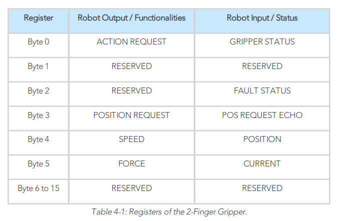
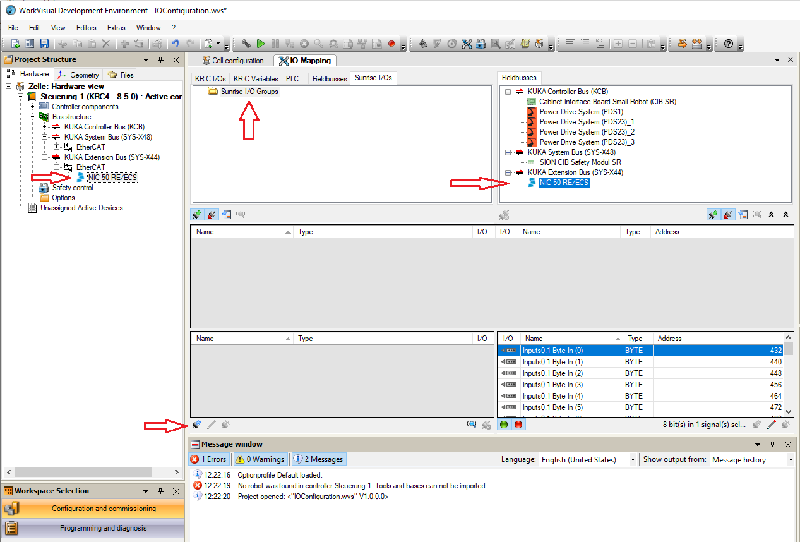
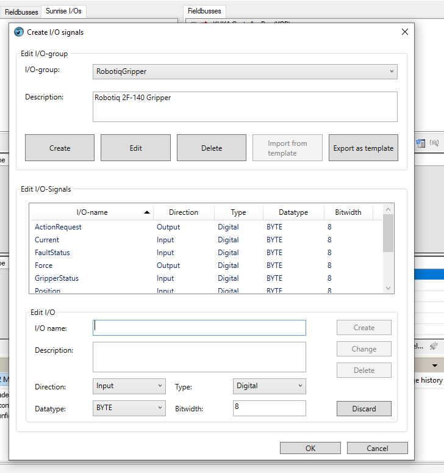
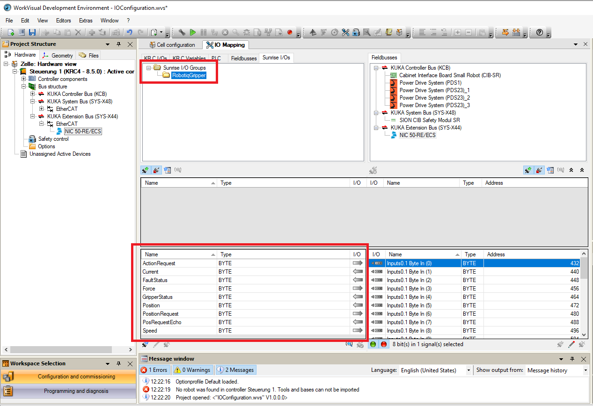
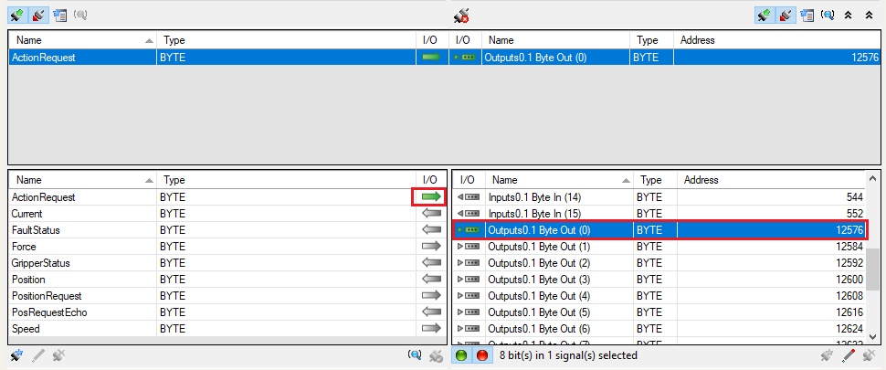
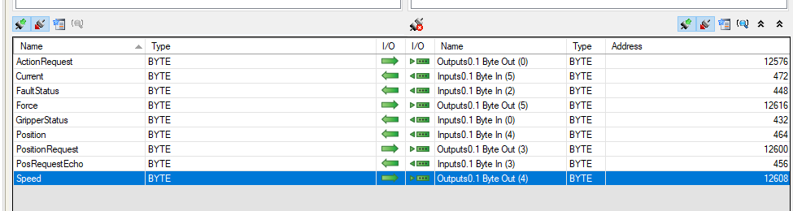
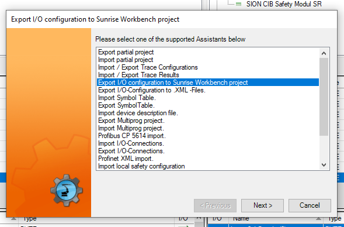

How to install, setup and control the Robotiq 2F-140 Gripper on a Kuka LBR IIWA using EtherCAT
---
- Assuming that the gripper is connected to Robotiq's universal controller and the controller is connected to KUKA X65 interface with an ethernet cable (ETH0 port).

- Download from Robotiq's website the Universal Controller Configuration. Go to the product [page](https://robotiq.com/products/2f85-140-adaptive-robot-gripper), choose "Download files" --> "Other brands" --> "Software" --> "Universal Controller Configuration" --> "EtherCAT" --> "Download XML" (you can find the file in this repository XML folder too).

- Open WorksVisual and go to "File --> Close", to close your current project.

- Import the XML configuration file: "File" --> "Import / Export" --> "Import device description file" --> "Browse", and set the file type to "EtherCAT ESI". It should import the "NIC 50-RE/ECS" device.

- Close WorksVisual. Open the Sunrise Workbench Project and add an IOConfiguration.wvs file: "File" --> "New" --> "I/O Configuration".

- Open the newly created IOConfiguration.wvs file and set your controller as active (right click on Steuerung1 on Project Structure tile and choose "Set as active controller").

- Add SYS-X44 to the Bus Structure. Right click on "Bus Structure" in the Project Structure tile under your active controller and choose "add --> KUKA Extension Bus SYS-X44".

- Add the gripper's controller to SYS-44 KUKA Extension Bus. Right click on EtherCAT under "KUKA Extension Bus(SYS-X44)", choose "add" and then find the controller(NIC 50-RE/ECS) in DTM selection list and press OK.

 *Project Structure with the gripper interface added.*

- The final step is to map the inputs and outputs of the gripper to the robot controller. We will use the Gripper Register Mapping from [Robotiq Instruction Manual](https://assets.robotiq.com/website-assets/support_documents/document/2F-85_2F-140_Instruction_Manual_e-Series_PDF_20190206.pdf):

You have to recreate the table above in WorksVisual. In the "Sunrise I/Os" tab choose the "NIC 50-RE/ECS extension bus and press "Creates signal at the provider"

In the newly opened window choose "Create" and add a group name and a group description. Then using the "Edit I/O" field add all the inputs and outputs of the table above. When you press "OK" you will have your new Sunrise I/O Group.

Finally you have to map the IO signals you have just created. From the table above the "ActionRequest" is the Byte0 and it is an output. You have to map it with the "Outputs0.1 Byte Out (0)". In order to do that you have to slide the green arrow of the "ActionRequest" to "Outputs0.1 Byte Out (0)". If you do it right you will see the mapping action in the field above:

The complete mapping:

- Export the I/O configuration to Sunrise Workbench with "File --> Import/Export --> Export I/O configuration to Sunrise Workbench project", upload the project to the robot controller and restart your robot.

